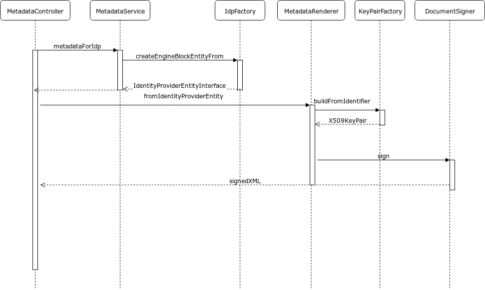

# EngineBlock SAML Metadata

EngineBlock specifies metadata for several entities. All related to its different roles as a SAML Proxy. Next to the 
expected SP and IdP metadata, EngineBlock also lists the connected IdP's it is proxying for.

This list of IdP's can also be limited by specifying a SP entity id. The generated IdPs metadata will now be limited to 
the IdP's that are connected to that SP. This can be usefull when creating WAYF feature.

Finally, metadata of the EngineBlock stepup authentication endpoint is available. 

Each of these metadata endpionts support key rollover.

Details about how to access the endpoints can be found on the EngineBlock home page <sup>[1]</sup>

This documentation is twofold. It describes the reasoning behind the generation of the Metadata as it is currently 
implemented (as of EngineBlock release 6.1). But it will also go into technical details. To aid future development teams 
in updating or maintaining metadata related features.

## Functional description

### Public SAML metadata of the OpenConext IdP Proxy

* Published at: https://engine.vm.openconext.org/authentication/idp/metadata
* Specifies the SSO location and the supported binding (HTTP-Redirect)
* Specifies the signing certificate

### Public SAML metadata of all the OpenConext IdPs

* Published at: https://engine.vm.openconext.org/authentication/proxy/idps-metadata
* Lists every connected IdP connected to the SAML Proxy
* The contact person information for EngineBlock is displayed
* The UIInfo and Organization information for the specific IdP is displayed
* The SSO location for the IdPs are specified at EngineBlocks SSO location. With the addition of a hash, identifying the 
  IdP. Example: `https://vm.openconext.org/authentication/idp/single-sign-on/abcdef001234567777778888abcd9999`
* The listing can be limited to a list of IdP's connected to a specified SP. Usefull when an SP wants to build a WAYF of
  their own. Filtering can be applied by specifying the `sp-entity-id` query string. Example: 
  `https://engine.vm.openconext.org/authentication/proxy/idps-metadata?sp-entity-id=urn:example.org`. 
 

### Public SAML metadata of the OpenConext SP Proxy

* Published at: https://engine.vm.openconext.org/authentication/sp/metadata                
* Specifies the ACS location and the supported binding (HTTP-POST)
* Specifies additional organization information (name, displayname, url)

### Similarities between EngineBlock SAML metadata documents
* Every document starts with a terms of use comment. This value can be configured in the `openconext.termsOfUse` ini 
  setting.
* The Metadata documents are signed.
* The Metadata documents are deemed valid for a period of 86400 seconds (1 day).
* The EngineBlock UIInfo elements are generated from the `engineblock.ini` config and are translated to English and 
Dutch when possible. Mainly English UI Info will be published. 
* The logo can be specified using the following `engineblock.ini` settings

```
defaults.logo = "/images/logo.png"
defaults.logo_width = 96
defaults.logo_height = 96 
```

* Where the `defaults.logo` path should be relative to the public `web` folder.

* The three supported name id formats are not (persistent, transient and unspecified) configurable.

* Contact person data is generated based on the `email.help` ini config value. For the GivenName element, the 
`suite_name` is used and for the SurName `Support` is always used.

## Technical design
The metadata endpoints are regular controller actions in the Symfony application (as they where prior to the EB 6.1 
changes). The routes are configured in `src/OpenConext/EngineBlockBundle/Resources/config/routing/metadata.yml`

The diagram shows which classes are responsible for creating the metadata.



Things get a little more interesting when the XML documents are created.

Rendering of the XML documents is performed by using the Twig template engine.

### Twig implementation details
Three xml templates have been created. Each including partials when using components that are reused between the three 
different SAML Metadata documents. See the functional specification for a listing of the shared elements.

The templates are rendered based on a `IdentityProviderEntityInterface` or an SP counterpart when rendering SP metadata.
The rendered template is then signed by the `MetadataRenderer` using its `DocumentSigner` 

The signed XML is rendered as a Symfony response with an XML content type.

### Decorators representing SAML entities
The metadata that is generated is based on the EngineBlock SP/IdP Entities. These entities where loaded from the 
`sso_provider_roles_eb5` table. Meaning that in order for EngineBlock to function, a Manage metadata push was required.

As of EngineBlock 6.1, EngineBlock no longer depends on the roles table for metadata generation. As specified in the 
functional description, all required data is either loaded from the EngineBlock ini configuration, or is hard-coded into 
the application.

EngineBlock uses IdP and SP entities throughout the application. The entities are used for different purposes. For 
example when publishing metadata. An IdP entity an be used in the context of EngineBlock in its role of the proxy IdP. 
But IdP entities are also represented in the IdPs metadata document. Both IdP entites behave slightly different. In 
order to prevent a lot of controll logic to test how the entity should be handled, we used the decorator pattern. 
Decorators for different SP/IdP roles have been created. 

A detailed overview about the specific implementation of the pattern can be found here <sup>[2]</sup>  

### Key rollover
The keys used for signing/encryption are configured in the EngineBlock.ini. Calling the metadata with a key identifier
will cause the metadata to be updated, using the specified key to sign the document and put it as the signing 
KeyDescriptor. Which is the whole idea of the key rollover pricible.

When the SP or IdP entity is decorated, the key identifier that was passed to the controller action is used to load the
appropriate key pair (using the key pair factory). This factory reads the keys from the filesystem location configured
in the engineblock.ini. And creates an X509 keypair. 

This keypair is loaded on the decorator and used to show the correct certificate value in the XML metdata. 

### Tests

The metadata generation is tested on multiple levels. 

**Unit tests**
All business logic touching on Metadata generation has been unit tested. 

**Functional tests**
A behat test feature was created, covering the most important aspects of the metadata generation.

The scenarios can be found in: `src/OpenConext/EngineBlockFunctionalTestingBundle/Features/Metadata.feature`

**Visual regression / smoke tests**
No visual regression or smoke tests have been created


# References
[1]: https://engine.vm.openconext.org/
[2]: metadata_decorators.md
